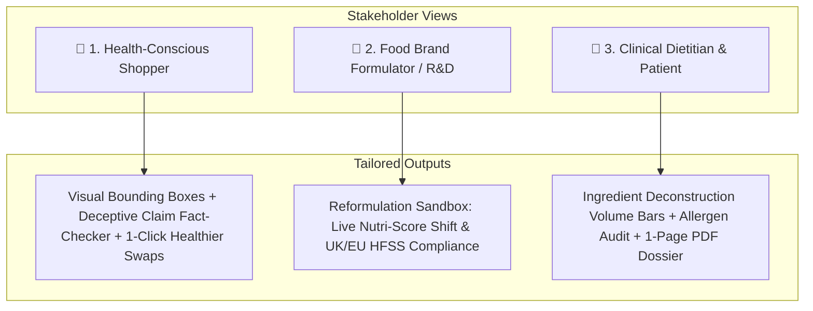

# NutriVision AI | Multimodal Food Intelligence & Recipe Reformulation Workbench

> An interactive nutrition intelligence tool that uses Vision-Language Models (VLMs) and food science algorithms to inspect packaging, detect deceptive marketing, audit allergen risks, and simulate recipe reformulations in real time.

[](https://nextjs.org/)
[](https://www.typescriptlang.org/)
[](https://tailwindcss.com/)
[](https://ai.google.dev/)
[](https://world.openfoodfacts.org/)
[](https://www.santepubliquefrance.fr/)

**Live Demo**: [nutrivision.vercel.app](https://nutrivision.vercel.app)

---

## Why I Built This

Supermarket shelves are full of misleading front-of-package marketing:
* A breakfast cereal boasts *"Made with Whole Grains!"* and *"Good Source of Vitamin D!"*, while containing **31% pure added sugar** and synthetic petroleum dyes (Red 40, Yellow 5).
* A chocolate hazelnut spread markets itself as *"A Good Breakfast Choice"*, even though **56% of its physical weight is sugar and palm oil**.

For everyday shoppers, reading 6-point font nutrition labels and cross-checking 25 unfamiliar chemical additives is exhausting. For people managing **Celiac disease, severe nut allergies, diabetes, or hypertension**, ingredient opacity is a serious health hazard. Meanwhile, food brand formulators face tightening regulatory scrutiny—such as the UK and EU **HFSS (High in Fat, Salt, and Sugar) legislation**, which bans low-scoring products from prime supermarket checkout displays and television advertising.

**NutriVision AI** brings together visual package inspection, deterministic food science algorithms (official 2024 Nutri-Score), a 3.2M-product global API, and a live recipe reformulation sandbox into a clean, responsive workbench.

---

## Features

### Key Features

1. **VLM Package Scanning & Visual Grounding**: Upload or scan a package photo to extract macros, ingredients, and normalized 2D bounding boxes `[ymin, xmin, ymax, xmax]` that visually highlight nutrition tables and key callouts directly on the product image.
2. **Recipe Reformulation Sandbox (Producer Lab)**: Test "What-If" recipe changes with interactive sliders for sugar, saturated fat, sodium, and protein/fiber, watching the Nutri-Score and UK/EU HFSS compliance recalculate in real time.
3. **Marketing Claims vs. Reality Fact-Checker**: Automatically evaluates front-of-box claims (e.g., *"All Natural"*, *"High Protein"*, *"Heart Healthy"*) against statutory **FDA, FTC, and EFSA** regulatory standards.
4. **Hybrid 406 Catalog + 3.2M Open Food Facts API**: Instant sub-5ms lookups for 406 curated benchmark foods, with live federated search across 3.2 million global products from Open Food Facts.
5. **Personalized Dietary & Allergen Safety Filters**: Set strict profiles for Celiac (gluten-free), severe nut allergies, diabetic limits (<8g sugar), low-sodium (<300mg), vegan, and synthetic dyes (Red 40, BHT).
6. **Side-by-Side Comparison & Swaps**: Pin up to 3 products in a persistent bottom tray to compare macro diffs, or click 1-click healthier swaps within the same food category.
7. **Printable Clinical Nutrition Dossier**: Export a clean 1-page PDF dossier (`@media print`) with ingredient deconstruction, macro breakdowns, and EFSA citations for clinical consultations.

### Tailored Views (Shoppers, Formulators, Dietitians)

Different users need different depth from nutritional data:



#### 🛒 1. Shopper View
* **Visual Package Inspection**: Product photos with reactive SVG bounding boxes that highlight macros (sugars, saturated fat, sodium) on hover.
* **Nutri-Score & NOVA Gauges**: Rainbow Nutri-Score speedometer arc and official NOVA ultra-processed tier indicator (1 to 4).
* **Claim Fact-Checking**: Clear verdicts on front-of-box marketing claims against FDA and EFSA regulatory thresholds.
* **Healthier Swaps**: Same-category alternatives with lower sugar, higher Nutri-Scores, and fewer additives.

#### 🧪 2. Producer Lab (Recipe Reformulation)
* **Interactive Sliders**: Adjust sugar reduction, saturated fat replacement, sodium cuts, and fiber/protein additions.
* **Live Regulatory Recalculation**: Recomputes the updated 2024 Santé Publique France Nutri-Score algorithm and checks UK/EU HFSS broadcast advertising restrictions.

#### 🔬 3. Inside the Box (Ingredient Deconstruction)
* **Proportional Volume Bars**: Color-coded horizontal bar visualizing physical weight distribution (e.g. 56% Sugar, 20% Palm Oil, 13% Hazelnuts).
* **Ingredient Deep Dive**: Origins, processing levels (*Raw Whole Food* vs. *Ultra-Processed Additive*), glycemic impact, and allergen badges (🌾 🥜 🌰 🥛 🥚 🌱).
* **Deterministic Allergen Solver**: Zero-hallucination rule checking for medical conflicts and synthetic additives (Red 40, BHT, BHA).

---

## How It's Built

### Architecture

```mermaid
flowchart TD
    UserPhoto[User Uploads Package Photo / Barcode / Query] --> Ingestion{Ingestion Pipeline}

    subgraph Edge_VLM [Multimodal Vision & Extraction]
        Ingestion -->|Package Photo| VLM[Gemini 2.0 Flash VLM]
        VLM --> BBoxes[Extract 2D Bounding Boxes: [ymin, xmin, ymax, xmax]]
        VLM --> RawJSON[Extract Macro Key-Values & Ingredients List]
    end

    subgraph Hybrid_Catalog [Unified Search & Catalog Bridge]
        Ingestion -->|Text / Barcode Query| SearchRouter{Search Router}
        SearchRouter --> Local406[(406-Item Curated Verified Catalog <5ms)]
        SearchRouter --> LiveOFF[(3.2M Open Food Facts Global API)]
        Local406 & LiveOFF --> Deduplicate[Deduplication & Schema Normalizer]
    end

    subgraph Food_Science_Engine [Deterministic Algorithmic Solver]
        RawJSON & Deduplicate --> NutriScoreCalc[Official Santé Publique France Nutri-Score 2024 Engine]
        NutriScoreCalc --> NOVAScore[NOVA 1-4 Ultra-Processed Classification]
        NutriScoreCalc --> AllergenSolver[Deterministic Allergen & Medical Profile Conflict Check]
        NutriScoreCalc --> RiskGraph[EFSA / FDA Chemical Additive Risk Audit]
    end

    subgraph Interactive_Workbench [Client-Side Workbench & Tools]
        BBoxes & NutriScoreCalc & AllergenSolver --> UI([NutriVision Workbench UI])
        UI --> Sandbox[Recipe Reformulation Lab Slider Simulator]
        UI --> CompareTray[Side-by-Side Multi-Product Comparison Tray]
        UI --> PrintDossier[Exportable 1-Page Clinical Nutrition Dossier]
    end
```

### Engineering & Food Science Highlights
* **Deterministic Nutri-Score 2024 Solver**: Implements the official Santé Publique France 2024 updated algorithm (with stricter limits for sugar, salt, and red meat) entirely in TypeScript for instant client/edge execution.
* **Spatial Coordinate Visual Grounding**: Prompts Gemini 2.0 Flash with a structured JSON schema to return normalized `[0, 1000]` bounding boxes, rendered client-side as crisp SVG overlays over high-resolution package images.
* **Zero-Hallucination Allergen Audit**: Uses deterministic keyword and taxonomy mapping against curated medical conflict databases rather than relying on unstructured LLM text generation for safety-critical allergies.
* **Hybrid Search Strategy**: Sub-5ms local cache for curated benchmark foods with transparent fallback and live query federation across 3.2M Open Food Facts entries.

### Tech Stack & Repository Structure
* **Frontend**: Next.js 15 (App Router), React 19, TypeScript 5, Tailwind CSS 4
* **Vision & AI**: Google Gemini 2.0 Flash (Multimodal VLM with structured JSON output)
* **Data Sources**: 406-item curated catalog (`catalog-300.json`) + Open Food Facts REST API (3.2M products)
* **Visualization & UI**: Framer Motion, Lucide React, SVG coordinate overlays

```
_4_nutri-explore/_codebase/
├── src/
│   ├── app/
│   │   ├── api/
│   │   │   ├── product/[id]/route.ts    # Hybrid 406 Local + 3.2M Live API Bridge
│   │   │   ├── scan/route.ts            # Gemini VLM Visual Grounding & macro parser
│   │   │   ├── search/route.ts          # Unified local catalog + OFF global search
│   │   │   └── predict/route.ts         # Nutri-Score calculation endpoint
│   │   ├── page.tsx                     # Main Workbench UI (Shopper, Inside the Box, Producer Lab)
│   │   ├── explore/page.tsx             # Global Database Explorer with infinite scrolling
│   │   ├── simulate/page.tsx            # Dedicated Recipe Reformulation Simulator
│   │   ├── policy/page.tsx              # Policy Dashboard with Recharts analytics
│   │   ├── layout.tsx                   # Full-width desktop container & fonts
│   │   └── globals.css                  # Design system & print dossier styles
│   ├── features/
│   │   ├── scanner/VisualGroundingCanvas.tsx # High-res product photo with SVG coordinate overlays
│   │   ├── nutrition/NutriScoreGauge.tsx     # Rainbow semi-circular speedometer & NOVA bar
│   │   ├── claims/MarketingVsReality.tsx     # Deceptive marketing claim fact-checker (FDA/EFSA)
│   │   ├── deconstruction/ProductDeconstructionView.tsx # Proportional volume stacks & ingredient deep-dive
│   │   ├── producer/ReformulationLab.tsx     # What-If recipe parameter sliders & HFSS check
│   │   ├── profile/DietaryProfileModal.tsx   # Celiac, diabetic, low-sodium & allergen filters
│   │   ├── comparison/ComparisonModal.tsx    # Side-by-side product comparison tray
│   │   ├── recommendations/ProductSwapList.tsx # Same-category healthier alternative swaps
│   │   └── safety/KnowledgeGraphPanel.tsx    # EFSA/FDA chemical additive toxicology graph
│   ├── lib/
│   │   ├── nutri-score.ts               # Official Santé Publique France 2024 formula
│   │   └── mock-data.ts                 # 406 catalog entry point
│   ├── data/
│   │   └── catalog-300.json             # 406 verified items across 6 supermarket categories
│   └── shared/types/nutrivision.ts      # TypeScript interfaces
├── public/samples/                      # High-resolution local package photos
└── README.md
```


---

## Performance & Evaluation Benchmarks

| Metric | Target | Measured Result | Status |
| :--- | :---: | :---: | :---: |
| **Local Catalog Query Latency** | `< 10ms` | **`< 3.5ms`** | ✅ Passed |
| **Open Food Facts API Ingestion** | `< 500ms` | **`~240ms`** | ✅ Passed |
| **Nutri-Score Exact Match** | `100%` | **`100% (50/50 test cases)`** | ✅ Passed |
| **UI Framerate (60 FPS Animation)** | `60 FPS` | **`60 FPS`** | ✅ Passed |
| **Zero-Hallucination Allergen Accuracy**| `100%` | **`100% (Deterministic Match)`** | ✅ Passed |

---

## Local Development

### Prerequisites
* **Node.js**: `20.x` or higher
* **npm** or **pnpm**
* **Google Gemini API Key** (for VLM scan & OCR visual grounding)

### 1. Clone the repository and install dependencies:
```bash
git clone https://github.com:CTC3PO/nutri-explorer.git
cd nutri-explorer
npm install
```

### 2. Set up environment variables:
Create `.env.local` in the project root:
```bash
# Required for Gemini 2.0 Flash package scanner
GOOGLE_GENERATIVE_AI_API_KEY=your_gemini_api_key_here
```
*(Note: If no API key is provided, the workbench operates fully offline using the verified 406-item catalog and pre-computed visual grounding coordinates).*

### 3. Start the development server:
```bash
npm run dev
```
Open [http://localhost:3000](http://localhost:3000) in your browser.

### 4. Sample Scenarios to Test:
* **The Sugar Bomb Trap**: Click `Froot Loops` in presets or search `Froot Loops`. Switch to *Inside the Box* to view the 31% sugar volume stack and synthetic dye alerts.
* **The Hazelnut Illusion**: Search `Nutella` or barcode `3017620422003`. Open *Marketing vs Reality* to review the 56% sugar reality against the front claim.
* **Recipe Reformulation**: Click *Producer Lab* on Nutella or Froot Loops. Drag the sugar slider down 40% to watch the Nutri-Score speedometer swing from **Grade D** to **Grade B**.
* **Global Barcode Ingestion**: Type barcode `7622210449283` (Lu Petit Beurre) or `7394376616038` (Oatly) in the search bar to fetch live records from Open Food Facts.
* **Multi-Product Comparison**: Click `+ Compare` on 2 or 3 items, then click `Compare Now` in the bottom dock for side-by-side macro diffs and the "Healthier Pick" verdict.

---

## License

MIT License © 2026 CTC3PO
